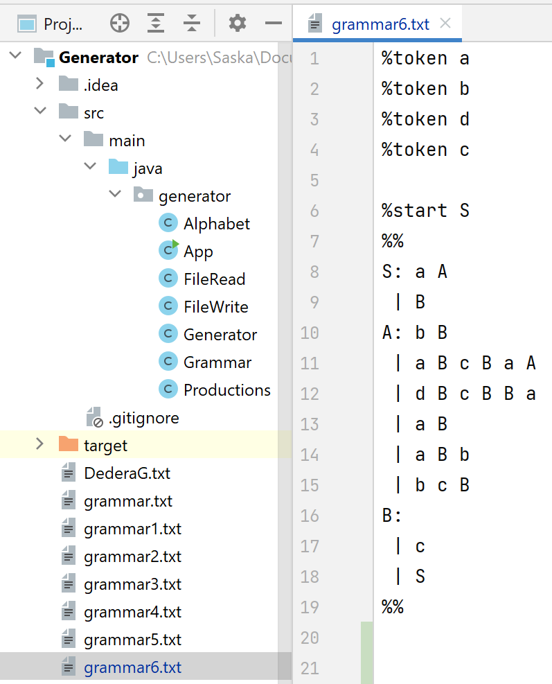
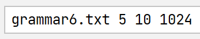
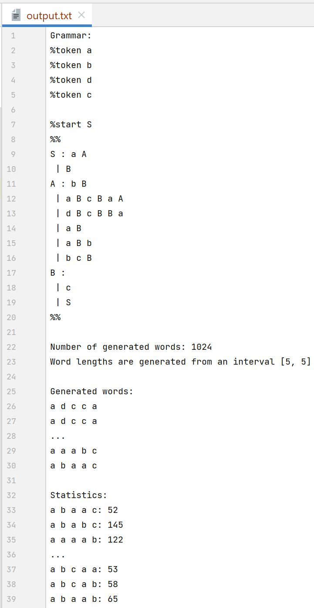

# Generator

Tento repozitár obsahuje praktickú časť mojej bakalárskej práce s názovom Generovanie náhodných reťazcov v bezkontextovej gramatike. Práca sa venuje implementácii náhodného generátora reťazcov v bezkontextovej gramatike
podľa článku Generating Strings at Random from a Context Free Grammar, ktorého autor je Bruce McKenzie. V práci sú popísané algoritmy pre úpravu gramatiky do požadovaného tvaru a algoritmus pre implementáciu celého generátora. Podľa týchto algoritmov bola naprogramovaná koncová Java aplikácia. V experimentálnej časti sa overila výrazne
menšia časová náročnosť generovania slova v závislosti od dĺžky slova v implementácii s použitím dynamického programovania. A taktiež sme testom dobrej zhody overili hypotézu, že všetky reťazce dĺžky n, ktoré gramatika G generuje majú rovnomerné rozdelenie, kde sme za n dopĺňali rôzne dĺžky reťazcov a za G rôzne gramatiky. Výsledkom práce je funkčná aplikácia na generovanie náhodných reťazcov v bezkontextovej gramatike.

## Používateľská príručka

Implementácia algoritmu z článku je konzolová java aplikácia, ktorá má 4 povinné vstupné parametre príkazového riadka. Textový súbor môže byť uložený kdekoľvek, ale do príkazového riadka musí byť zadaná celá cesta k nemu. Pokiaľ je gramatika uložená v priečinku, kde je aj priečinok
so zdrojovými kódmi do príkazového riadka stačí zadať názov súboru. Na nasledujúcom obrázku môžete vidieť príklad uloženia gramatiky vo formáte Bison do textového súboru.

Ak by sme chceli generovať slová ľubovoľnej dĺžky z intervalu od 5 do 10 vrátane, parametre by vyzerali nasledovne:

Aplikácia všetky vstupné dáta spracuje a výstup zapíše do textového súboru s názvom output.txt, ktorý sa uloží do priečinku, kde je uložený priečinok so zdrojovými súbormi
aplikácie. Vo výstupnom súbore sú zhrnuté parametre s ktorými bola aplikácia spustená, čiže gramatika, počet vygenerovaných slov a interval dĺžky generovaných slov. Ďalej nasledujú jednotlivé vygenerované slová a na záver štatistika hovoriaca o tom koľko krát sa dané slovo vygenerovalo. Na nasledujúcom obrázku môžete vidieť skrátený obsah výstupného súboru.

